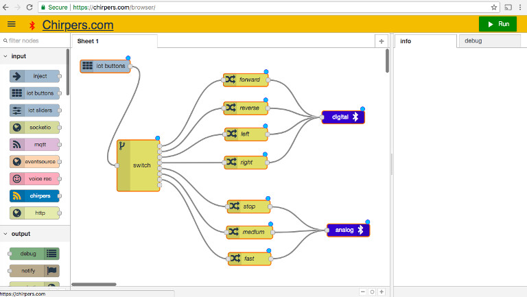
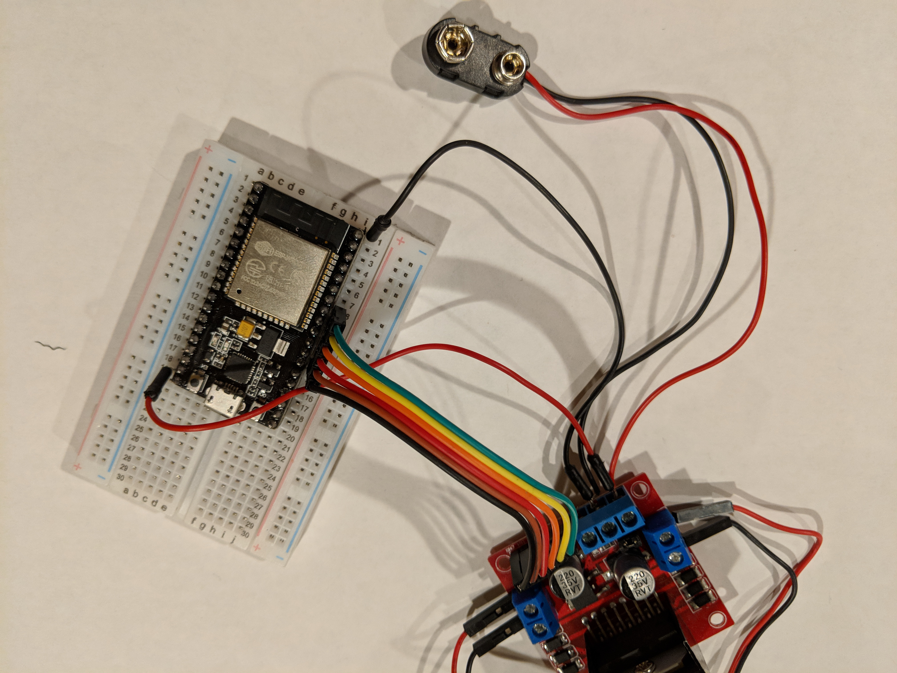
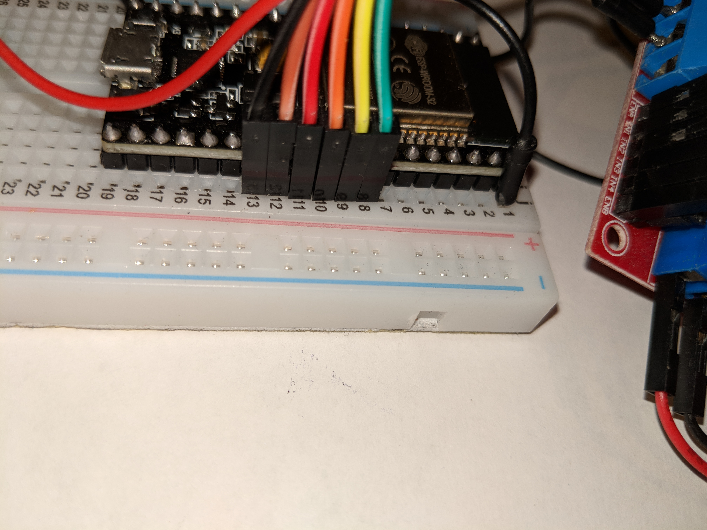
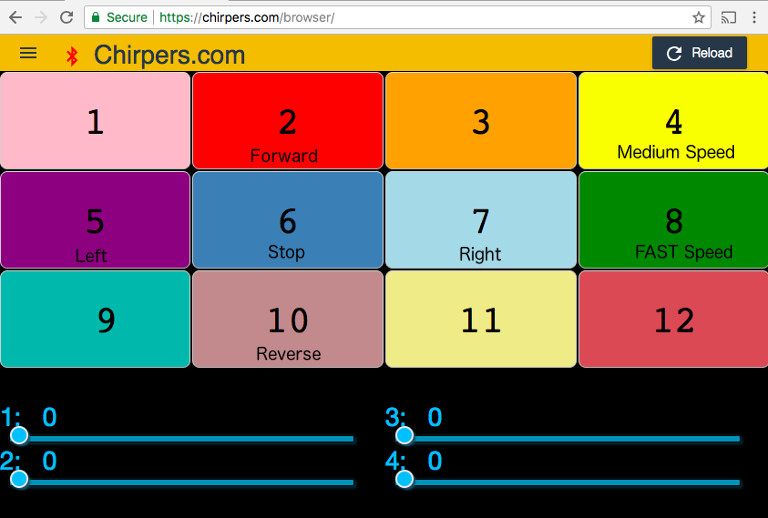
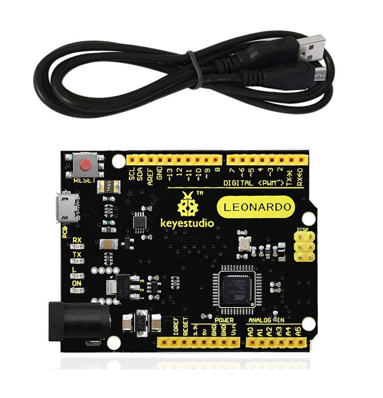
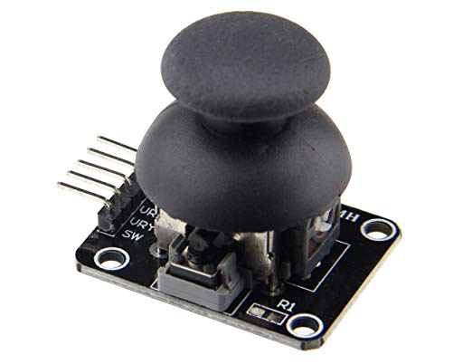

# Nodebots Day 2018

## Our bots for today

* Sprout Run Rover chassis
* ESP32 - Micrcontroller (nodemcu-32s)
* L298N - Motor Driver
* Motors
* Batteries
* wheels
* Wires

## Web Bluetooth

* service Id: `bada5555-e91f-1337-a49b-8675309fb099`
* digital Characteristic `2a56`
* analog Characteristic `2a58`

[firmware](nodemcu_32s_firmware)
[service details](https://github.com/monteslu/ble-io/blob/master/service.md)

## Bot Assembly

* connect wheels
* connect fin
* connect breadboard bracket
* wiring
* customize your bot!
* connect battery pack

## Wiring

## Connecting to the bot with Chirpers

[https://chirpers.com/browser](https://chirpers.com/browser)

Import -> Examples -> nodebotsday 2018 nodemcu-32s

Click the Run button and connect to YOUR bot!
(bot ID on bottom of breadboard)

## Controlling the bot

Switch to IOT Remote Buttons view in menu.

## Custom Controller

* Leonardo - Micrcontroller
* joystick
* breadboard
* wires
* resistor

